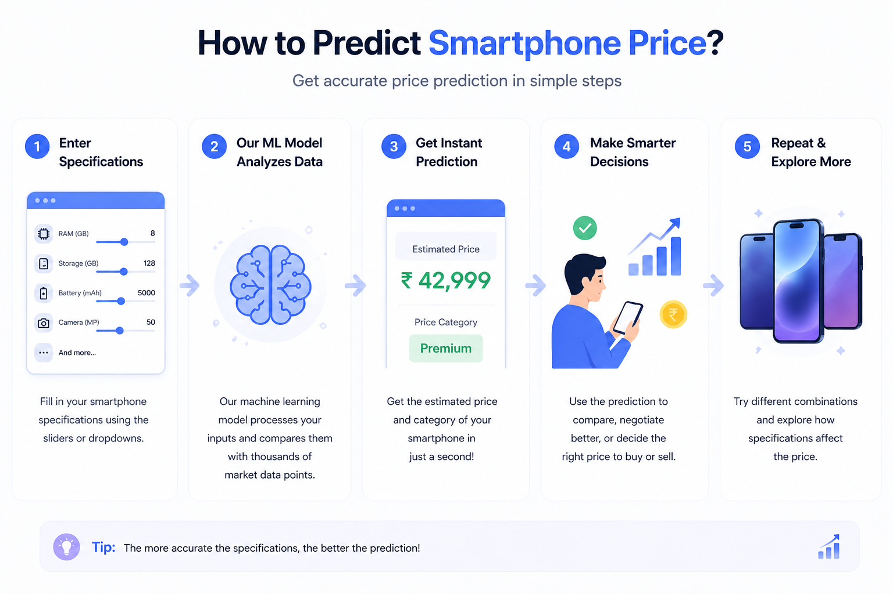

# 📱 Smartphone Price & Category Prediction

🔗 **Live App:**  
👉 https://smartphone-price-category-predictor-ml.streamlit.app/

---

## 🚀 Project Overview

This project is a **Machine Learning-powered Streamlit web application** that predicts:

- 💰 Smartphone Price
- 🏷️ Price Category (Budget / Midrange / Premium)

based on real-world smartphone specifications.

---

## 📸 App Preview

---

## ⚙️ Features

- Interactive UI (sliders & dropdowns)
- Real-time prediction
- Clean and simple design
- Multiple brand support
- Instant results

---

## 🧠 Machine Learning Models Used

### 🔹 Price Prediction
- Algorithm: **Random Forest Regressor**

### 🔹 Category Prediction
- Algorithm: **Classification Model (Random Forest / similar)**

---

## 🧩 Input Features

- RAM (GB)
- Storage (GB)
- Battery (mAh)
- Fast Charging (W)
- Rear Camera (MP)
- Front Camera (MP)
- WiFi Version
- Brand (One-Hot Encoding)

---

## 🛠️ Tech Stack

- Python
- Streamlit
- Pandas
- NumPy
- Scikit-learn
- Pickle

---

## 📂 Project Structure
smartphone-price-category-predictor-ml-app/
│
├── app.py
├── code.ipynb
├── features.pkl
├── final_rf_model.pkl
├── price_category_model.pkl
├── requirements.txt
├── README.md
│
├── assets/
│ └── app_preview.png

## 👨‍💻 Author

**Sumit Ghodke**  
Aspiring AI Engineer | Data Scientist  

💼 LinkedIn:  
👉 [Connect with me](https://www.linkedin.com/in/sumit-ghodke-a45a82205/)  

📌 Open to opportunities in:
- Data Science  
- Machine Learning  
- AI Engineering  
